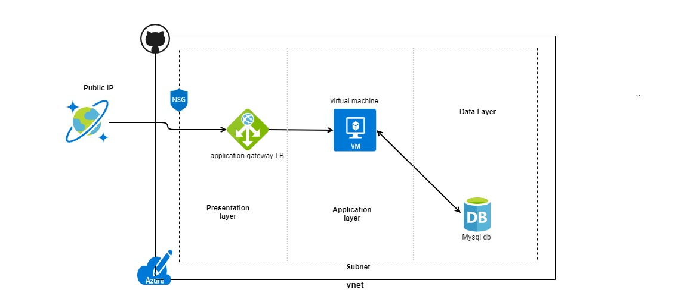

# technical_challenge
tech challenge assignment

## Tools
1. Azure
2. Terraform - 1.1.9
3. Az CLI
4. GIT (Github)
5. Java/Maven

## Challenge #1
Design a 3-tier environment - Azure



What is 3-Tier Environment?
Three-tier architecture/Environment is a well-established software application architecture that organizes applications into three logical and physical computing tiers: the presentation tier, or user interface; the application tier, where data is processed; and the data tier, where the data associated with the application is stored and managed.

## Solution:
I have proposed a design to deploy the infra on Azure with the most cost efficient design. Following are the resources I have provisioned using terraform.

1. Application Gateway - load balancer with internet facing Public IP which will be operating on Application layer (layer 7) and will be routing traffic to the web server.
2. Virtual Machine - A Ubuntu webserver to run application and is connected with a database.
3. My SQL database - An azure managed My SQL database to storing application data.
4. Virtual Network - Virtual network for the resources
5. Subnet - contains CIDR block for network to contain app gateway load balancer, vm and db.
6. Network Security groups - contains security rules that allow or deny inbound network traffic to and from internet to resources in vnet.
7. Resource group - container to keep all the resources in sub.

### Modules: 
Includes modules approach to keep all the resources and call them n main.tf file

** challenge-01 directory **
```
tf
|-- modules/            // The directory for sub modules.
|-- main.tf             // The primary entrypoint for terraform resources.
|-- _variables.tf       // It contain the declarations for variables.
|-- _provider.tf        // The file which containes azure provider config.
|-- terraform.tfvars    // The file to pass the terraform variables values.
```

A module is a container for multiple resources that are used together. Modules can be used to create lightweight abstractions, so that you can describe your infrastructure in terms of its architecture, rather than directly in terms of physical objects.

For the solution, we have created and used five modules:

resourcegroup - creating resourcegroup
networking - creating azure virtual network and required subnets
securitygroup - creating network security group, setting desired security rules and associating them to subnets
compute - creating availability sets, network interfaces and virtual machine
database - creating database server and database
loadbalancer - creating application gateway for load balancing

All the stacks are placed in the modules folder and the variable are stored under terraform.tfvars

To run the code you need to append the variables in the terraform.tfvars

Each module consists minimum two files: main.tf, vars.tf

resourcegroup, load balancer and networking modules consists of one extra file named output.tf

### Deployment

#### Steps

Step 1 terraform init - used to initialize a working directory containing Terraform configuration files

Step 3 terraform plan - used to create an execution plan

Step 3 terraform validate - validates the configuration files in a directory, referring only to the configuration and not accessing any remote services such as remote state, provider APIs, etc

Step 4 terraform apply - used to apply the changes required to reach the desired state of the configuration

## Challenge #2
Write code that will query the meta data of an instance within AWS or Azure or GCP and provide a json formatted output.

## Solution:

I have used java/Maven code + Azure VM example to fetch metadata like vm size, version, os Type etc. 

** challenge-02 directory **

azure-metadata-json
    |--testAzureApp
        |------src
        |------target
        |------pom.xml

Navigate to App.java class in /main/java/com/azure folder 

Step 1: create a service principal to create connection - 
``` bash
az ad sp create-for-rbac --name AzureJavaTest --role Contributor --scopes "/subscriptions/<subid> 
```
Configure AZURE_SUBSCRIPTION_ID, AZURE_CLIENT_ID, AZURE_CLIENT_SECRET, AZURE_TENANT_ID as environment variables.

Step 2: Run mvn compile exec:java to execute the code

I have used the example of VM I have created from challenge-01

Step 3: Get the output on console in json format, getResoucegroup() function returns a parsed value.

## Challenge #3
Write a function where you pass in the object and a key and get back the value. 

Example Inputs
object = {“a”:{“b”:{“c”:”d”}}}
key = a/b/c
object = {“x”:{“y”:{“z”:”a”}}}
key = x/y/z
value = a

## Solution:

Create a python file - function.py

- getNestedValue() function returns the value
- getKey() function parses the keys in object (nested keys)
